# Slicer Slice Viewer Icons

Below is a current snapshot of icons for Slicer's Slice Viewers. 

To create NEW icons to add to this set, please follow [this simple workflow NOT YET LINKED]. The workflow will refer icon designers to Slicer's [Icon Design Guildelines] and Slicer's [Color Palette] to ensure new icons are visually compatible with Slicer's icons and that they work well in both Dark and Light Themes.

## Icon set symbolics

* **Source (volumes):** orthographic cube

* **Image|view|slice:** 2D plane with (if resolution permits) axis & 4 quadrants OR 4 voxels 

* **Action/processing:** "Action Amber" object color coding

* **Slice Viewer | image viewer:** Plane with R|G|Y bar across top
  
* **Segmentation form:** dyadic object that describes combination of 2D (grid) and 3D mesh representations

* **Segmentation color:** "SegmentationEditorGreen" fill color, "SegmentationAndLabelGridGreen" grid color and SegmentationAndLabelOutlineGreen for outline

## Full Icon set for Slice Viewers Dark and Light Themes:

Light & Dark Theme 

|Icon |Name |
|-----|--------|
|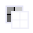 | DarkTheme BackgroundLayer |
|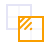 | DarkTheme BlendMode |
|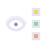 | DarkTheme EachSegmentVisibility |
|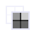 | DarkTheme ForegroundLayer |
|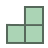 | DarkTheme LabelMapDisplayFill |
|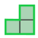 | DarkTheme LabelMapDisplayFillAndOutline |
|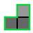 | DarkTheme LabelMapDisplayOutline |
|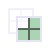 | DarkTheme LabelMapLayer |
|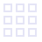 | DarkTheme LightboxView |
|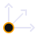 | DarkTheme OrientationMarker |
| | DarkTheme ResetFieldOfView |
| | DarkTheme RotateToVolumePlane |
|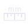 | DarkTheme RulerDisplayOptions |
|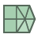 | DarkTheme SegmentationDisplayFill |
| | DarkTheme SegmentationDisplayFillAndOutline |
|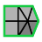 | DarkTheme SegmentationDisplayOutline.svg |
|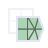 | DarkTheme SegmentationLayer |
| | DarkTheme SlicePlanes-Axial |
|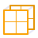 | DarkTheme SlicePlanes-Coronal |
|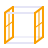 | DarkTheme SlicePlanes-Sagittal |
| | DarkTheme SliceSpacing |
| | DarkTheme ThickSlabReconstruction |
|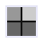 | DarkTheme ToggleOFF-Interpolation |
|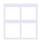 | DarkTheme ToggleOFF-MaximizeView |
| | DarkTheme ToggleOFF-ReformatWidget |
|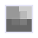 | DarkTheme ToggleON-Interpolation |
|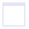 | DarkTheme ToggleON-MaximizeView |
| | DarkTheme ToggleON-ReformatWidget |

## Specific Colors included in SlicerSimplePalette

SliceViewer Action Amber (SWAP / LightTheme):
* HEX #ED8800FF

SliceViewer Action Amber (SWAP / DarkTheme):
* HEX #FA9F00FF

Slicer Segmentation and Label Grid Green (SWAP / LightTheme):
* HEX #738C79FF

Slicer Segmentation and Label Grid Green (SWAP / DarkTheme):
* HEX #56695BFF

Slicer Segmentation and Label Outline Green (GLOBAL / Both themes):
* HEX #14CC42FF

Slicer Segmentation Primary Fill Green (GLOBAL / Both themes):
* HEX #ABD4B5FF

